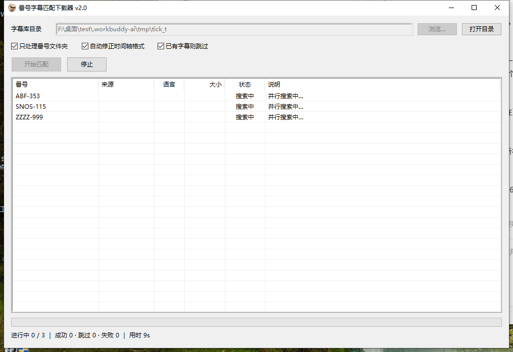

# subtitle-matcher

**番号字幕自动匹配下载器** —— 扫描本地媒体库目录，自动到多个字幕站搜索并下载中文字幕。

图形界面，单个 `.exe` 文件，无任何运行时依赖，双击即用。



---

## 功能

- **图形界面** —— 不用命令行。选目录、看进度、看结果全在窗口里
- **多站并行搜索** —— 同时到三个站点搜，哪个有结果就用哪个
- **跨站选优** —— 语言优先（简体 > 繁体），同语言下**选文件最大的**
- **下载失败自动退到下一个候选** —— 首选站的 CDN 挂了也不会白跑
- **自选目录** —— Windows 原生文件夹选择框，任意磁盘、任意路径
- **自动跳过** —— 文件夹内已有字幕文件则跳过
- **自动命名** —— 保存为「文件夹同名.srt」（ASS 内容会存成 `.ass`），直接适配 Jellyfin / Emby / Plex
- **时间轴规范化** —— 自动修正第三方字幕的非标准时间轴，否则播放器根本读不出来

## 使用

双击 `SubtitleCatMatcher.exe`：

1. 点「浏览…」选字幕库目录（也可以把目录直接拖到 exe 上，或用命令行传入）
2. 勾选需要的选项
3. 点「开始匹配」

窗口里会实时显示每个文件夹的来源、语言、大小、状态和说明。

### 界面选项

| 选项 | 默认 | 说明 |
|---|---|---|
| 只处理番号文件夹 | 开 | 只处理符合番号格式的目录名，避免误匹配 |
| 自动修正时间轴格式 | 开 | 把非标准时间轴改成标准 SRT |
| 已有字幕则跳过 | 开 | 目录里已有字幕文件就跳过 |

## 字幕来源

| 站点 | 状态 | 大小 | 语种 | 备注 |
|---|---|---|---|---|
| [subtitlecat.com](https://www.subtitlecat.com/) | 可用 | 列表页提供 `SIZE` | 简体 / 繁体 | 有 Cloudflare，响应 1~8s，偶尔更慢 |
| [aiyi1.com](https://www.aiyi1.com/)（爱译网） | 可用 | 列表页提供 `15KB` | 中文简体 / 中文繁体 | 直链 `.srt`，速度较快；搜索接口偶尔卡住 |
| [javzimu.com](https://javzimu.com/)（JAV字幕） | **受限** | 不提供 | 不提供 | 有 Cloudflare Turnstile 人机验证 |

### 关于 javzimu

javzimu 的搜索接口 `/api/search` 只有极少量的免费额度（实测约 2 次），之后就会返回：

```json
{"error":"Verification required.","turnstile_required":true,"remaining":0}
```

它要求先通过图片验证码，再通过 Cloudflare Turnstile 才能继续。**Turnstile 必须在真实浏览器里执行，无法用纯 HTTP 客户端完成**，本工具也不会去绕过它。

所以 javzimu 被实现为「尽力而为」：额度还有时正常返回结果，被要求验证时就在界面上如实标注 `JAV字幕 需要人机验证`，然后由另外两个站点接管。

## 匹配规则

1. 用文件夹名作为关键字，**并行**到三个站点搜索
2. 各站解析出候选字幕，带上语言和文件大小
   - 站点没提供大小的（javzimu）会补一次 `HEAD` 请求拿到真实大小，保证比大小是公平的
3. 合并所有候选，按「语言优先（简 > 繁）→ 同语言取最大」排序
4. 从最优候选开始下载；失败就退到下一个候选（最多 3 个）
5. 保存为 `<文件夹名>.srt`

### 防误匹配

把任意目录名丢去搜索会匹配到完全无关的字幕（例如 `subtitle-matcher` 曾匹配到某部毫不相干的片子）。因此有两道防线：

- **番号格式过滤** —— 默认只处理符合番号格式的文件夹，正则为
  `^\d{0,5}[A-Z]{2,10}[-_ ]?\d{2,6}`，覆盖 `SNOS-115`、`SSIS-001`、`259LUXU-1234`、`HEYZO-1234` 等常见写法
- **标题相关性校验** —— 搜索结果标题归一化（去符号、转大写）后必须真的包含该番号，否则丢弃

### 超时与限速

站点响应速度差异很大，所以每个站点有独立的限速、超时和重试策略：

| 站点 | 请求间隔 | 单次超时 | 重试 |
|---|---|---|---|
| subtitlecat | 700ms | 20s | 2 次 |
| aiyi1 | 1000ms | 15s | 1 次 |
| javzimu | 1500ms | 10s | 1 次 |
| 字幕下载（CDN） | 200ms | 60s | 2 次 |

单个文件夹的**搜索阶段整体限时 45 秒**：某个站点卡住时，用已经拿到的候选继续往下走，而不是一起干等。

界面上会区分「站点确实没有」和「站点响应超时」——后者是网络或风控问题，稍后重试往往就好了。

## 时间轴规范化

站点上有相当一部分字幕来自第三方转换工具（如 `aisubs.app`），时间轴写法**不符合 SRT 标准**：

```
0
00：00：00.000-> 00：00：02.000      ← 全角冒号 + "->" + 点号毫秒
  你
```

这种文件在 ffmpeg（也就是 Jellyfin / Emby 的字幕解析）里**根本不会被识别**——只认 `-->` 和半角冒号。
更麻烦的是，部分文件还在时间轴数字中间塞了**零宽空格**（`00：01：46.0[ZWSP][ZWSP]00`），
肉眼完全看不出来，任何解析器都读不出时间。

所以下载后会自动规范化：

| 原始写法 | 规范化后 |
|---|---|
| `00：00：00.000-> 00：00：02.000` | `00:00:00,000 --> 00:00:02,000` |
| `0：0：1.5-> 0：0：2.25` | `00:00:01,500 --> 00:00:02,250` |
| `02：12：12：50.280`（分钟被重复） | `02:12:50,280` |
| `01：06：29.2900`（毫秒 4 位） | `01:06:29,290` |
| `00：01：46.0[ZWSP][ZWSP]00` | `00:01:46,000` |

几条原则：

- **只改能完整解析成时间轴的行**，正文一个字都不动
- 分钟重复那类损坏，**只有重复段确实相等才折叠**，否则原样保留——宁可不动，也不猜错
- 零宽字符里**不动 U+200D（ZWJ）**，因为它在 emoji 和部分语系里有实际语义
- 顺带把 UTF-16 / 带 BOM 的文件转成 UTF-8

关掉「自动修正时间轴格式」即保留原始文件。

## 编译

需要 Go 1.20+。

```bash
# 图形界面版（不弹控制台窗口）
go build -trimpath -ldflags "-s -w -H windowsgui" -o SubtitleCatMatcher.exe .

# 调试用的控制台版
go build -trimpath -ldflags "-s -w" -o SubtitleCatMatcher-cli.exe .
```

仓库中已包含 `rsrc.syso`（图标 + manifest 资源），`go build` 会自动链接，图标开箱即用。

### 重新生成图标资源

如果想换图标：

```bash
# 1. 任意图片 → 多尺寸 ICO（需要 Python + Pillow）
python -c "
from PIL import Image
im = Image.open('cat.webp').convert('RGBA')
w, h = im.size; s = min(w, h)
im = im.crop(((w-s)//2, (h-s)//2, (w-s)//2+s, (h-s)//2+s))
im.save('app.ico', format='ICO',
        sizes=[(16,16),(24,32),(32,32),(48,48),(64,64),(128,128),(256,256)])
"

# 2. 生成资源文件（需要 rsrc：go install github.com/akavel/rsrc@latest）
rsrc -ico app.ico -manifest app.manifest -o rsrc.syso -arch amd64

# 3. 重新编译
go build -trimpath -ldflags "-s -w -H windowsgui" -o SubtitleCatMatcher.exe .
```

`app.manifest` 里声明了 comctl32 v6 依赖（否则控件会退化成 Win95 经典外观）和 PerMonitorV2 DPI 感知。

## 调试用命令行

正常使用不需要命令行。控制台版保留了一个调试入口：

```bash
SubtitleCatMatcher-cli.exe -cli "D:\影片"        # 走控制台流程
SubtitleCatMatcher-cli.exe -cli -all "D:\影片"   # 不筛番号
SubtitleCatMatcher-cli.exe -cli -raw "D:\影片"   # 不做时间轴规范化
SubtitleCatMatcher-cli.exe -cli -jobs 6 "D:\影片" # 并发数
```

## 测试

```bash
go test -v ./...
```

覆盖了：

- 语言优先级（简体优先 / 繁体候补 / 无下载链接 / 英文标注不误判）
- 跨站选优与候选排序（语言优先于大小、已知大小胜过未知）
- `SIZE` 解析、番号格式识别、标题相关性
- 三个站点的页面解析（含 aiyi1 搜索结果与文章页、javzimu 的 JSON 与验证响应）
- 时间轴规范化的各种脏数据（全角冒号、`->`、零宽空格、分钟重复、毫秒位数、UTF-16、ZWJ 保护）
- 配置默认值兜底（零值超时会让搜索瞬间"全部超时"）

## 实现说明

- **纯标准库** —— 除了 Windows 系统 DLL 的 syscall 调用外，没有任何第三方依赖，`go.mod` 里没有 require
- **原生界面** —— `RegisterClassExW` + `CreateWindowExW` + `SysListView32` + `msctls_progress32`，全部走 syscall，不引入 GUI 框架，也不用 cgo
- **原生文件夹选择框** —— 直接调 `shell32.SHBrowseForFolderW`
- **源码结构** —— `win32.go`（系统调用层）/ `gui.go`（界面）/ `source.go`（各站点解析）/ `subtitle.go`（字幕校验与规范化）/ `engine.go`（调度与选优）/ `net.go`（限速 HTTP）/ `main.go`（入口）

## 声明

本工具仅用于下载用户已有媒体文件所对应的字幕，不提供、不存储、不分发任何音视频内容。
请遵守当地法律法规及目标站点的服务条款，合理使用。

## 许可

未指定。
